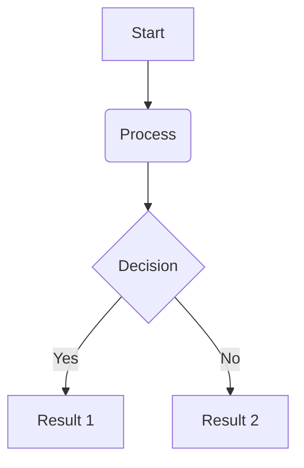

# Markdown Expert Skill

This skill provides advanced patterns and techniques for technical writing.

## Mermaid Diagrams
Use Mermaid to visualize concepts.
Example:


## Advanced Tables
Use GFM tables with alignment.
| Feature | Support | Description |
| :--- | :---: | :--- |
| GFM | Yes | Standard GitHub Markdown |
| Footnotes | Yes | Technical references |
| Checkboxes | Yes | Task tracking |

## Metadata (Frontmatter)
Start complex documents with YAML Frontmatter for better indexing.
```yaml
---
title: Document Title
author: Antigravity
tags: [markdown, expert, skill]
---
```

## Accessibility
- Always include `alt` text for images.
- Use semantic headers `#` (not just bold text).
- Avoid "click here" links; use descriptive link text.
