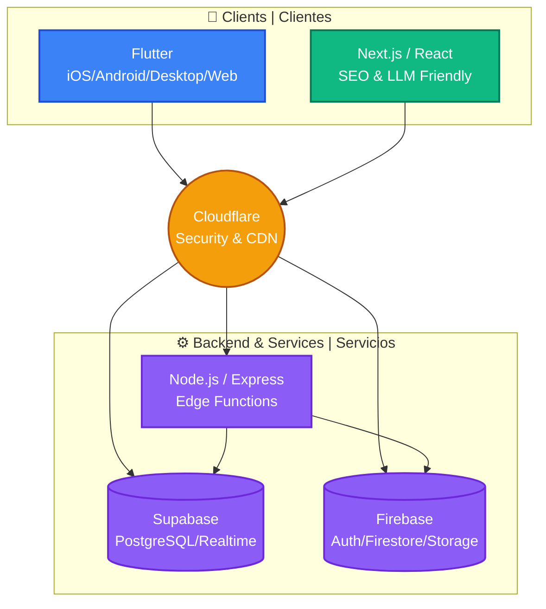

# Wilever Gómez (@wileverg)

🚀 **Multiplatform Developer | Desarrollador Multiplataforma** • Flutter • Firebase • Supabase
💼 **Founder:** [FlowUI](https://flowui.app) — Compliance as a Service
🌐 **Building in public | Construyendo en público** • Open source advocate

---

## 🛠 Tech Stack | Tecnologías

**Frontend:**

- 📱 Flutter (iOS, Android, Web, Desktop)
- ⚛️ React / Next.js — *For web to optimize SEO, LLM-friendly content, and generate traffic | Si es solo web, para optimizar el SEO, compatibilidad con LLMs y generar tráfico.*

**Backend:**

- 🔥 Firebase (Auth, Firestore, Functions, Storage) — *Focusing on free features to maximize value | Con énfasis en las características gratuitas para sacar el máximo provecho.*
- ⚡ Supabase (PostgreSQL, Auth, Realtime) — *My top choice for scaling any project with a flat rate | Mi primera opción para escalar cualquier proyecto con tarifa plana.*
- 🟩 Node.js / Express.js — *To simplify, mainly for edge functions | Para simplificar, principalmente enfocado en edge functions.*

**Tools & Platforms | Herramientas y Plataformas:**

- 🤖 Claude Code + MCPs (context7, firebase, github, supabase)
- 🌌 Antigravity IDE + Gemini CLI
- 🐙 GitHub Pro — *Extracting the most out of git and automating tasks | Para sacarle el jugo a git y automatizar cositas.*
- ☁️ Cloudflare — *For web and cloud security | Para web y seguridad en la nube.*

---

## 🏛 Architecture | Arquitectura

---

## 🚀 Current Projects | Proyectos Actuales

### FlowUI

Compliance as a Service platform built with Flutter + Firebase + Supabase.
*Plataforma de "Compliance as a Service" construida con Flutter + Firebase + Supabase.*
📱 iOS • 🤖 Android • 🌐 Web • 🖥 Desktop
🔗 [flowui.app](https://flowui.app)

### dev-ecosystem

Template to give your Mac, Windows, or Linux memory.
*Plantilla para que tu Mac, Windows o Linux tengan memoria.*

---

## 📊 Stats | Estadísticas

- 🇪🇸 **Location | Ubicación:** Based in Spanish-speaking timezone (Argentina) | *Ubicado en Argentina.*
- 💻 **Full-time:** FlowUI development | *Desarrollo de FlowUI.*
- 🎯 **Focus | Enfoque:** Building in public, side projects, digital identity consistency | *Construir en público, proyectos paralelos, consistencia de identidad digital.*
- 📚 **Lifelong learner | Aprendizaje continuo:** Always exploring new frameworks & patterns | *Siempre explorando nuevos frameworks y patrones.*

---

## 🎯 What I'm Currently Working On | En Qué Estoy Trabajando

- ⚙️ **Dev Environment Setup** — Maximizing Claude + Antigravity on Windows | *Maximizando Claude + Antigravity en Windows.*
- 🏢 **FlowUI Platform** — Building compliance tools for enterprises | *Construyendo herramientas de compliance para empresas.*
- 📢 **Build in Public** — Documenting journey & learnings in real-time | *Documentando el viaje y aprendizajes en tiempo real.*
- 🔬 **Side Projects** — Experimenting with emerging tech (AI, Web3, etc.) | *Experimentando con tecnologías emergentes.*

---

## 📝 Latest Blog Posts | Últimos Artículos

*Building in public coming soon... | Construyendo en público próximamente...*

---

## 🔗 Links | Enlaces

- 💼 [FlowUI](https://flowui.app)
- 📧 [wilevergomez@gmail.com](mailto:wilevergomez@gmail.com)
- 🐦 [@wileverg](https://twitter.com/wileverg) (Twitter/X)
- 🎨 [@wileverg](https://instagram.com/wileverg) (Instagram)
- 💻 [GitHub Profile](https://github.com/wileverg)

---

  <i>Made with ❤️ using Claude Code & Antigravity IDE | Hecho con ❤️ usando Claude Code y Antigravity IDE</i>

