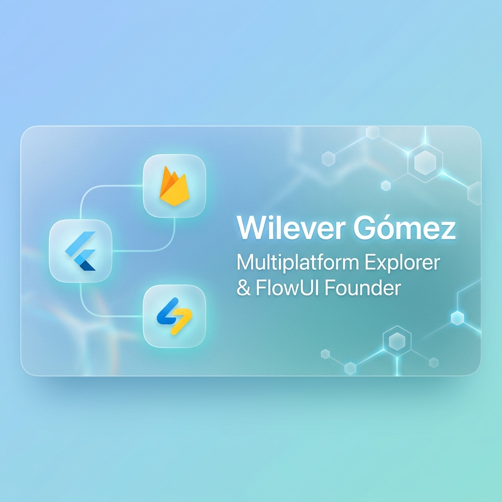

<script type="application/ld+json">
{
  "@context": "https://schema.org",
  "@type": "Person",
  "name": "Wilever Gómez",
  "url": "https://github.com/wileverg",
  "image": "https://raw.githubusercontent.com/wileverg/wileverg/main/assets/banner.png",
  "jobTitle": "Product Developer | Senior Flutter & Supabase Architect",
  "alumniOf": "Universidad de Oriente",
  "knowsAbout": ["Product Development", "Flutter", "Supabase", "Firebase", "PostgreSQL", "Software Architecture", "Health Tech", "Compliance"],
  "sameAs": [
    "https://www.linkedin.com/in/wileverg/",
    "https://twitter.com/wileverg",
    "https://github.com/wileverg"
  ]
}
</script>


# Wilever Gómez — Product Developer & Founder

<p align="right">
  <a href="README-es.md"><strong>Ver versión en Español</strong></a>
</p>

<p align="center">
  
</p>

<p align="center">
  <a href="https://linkedin.com/in/wileverg"></a>
  <a href="mailto:wilevergomez@gmail.com"></a>
  <a href="https://twitter.com/wileverg"></a>
</p>

<p align="center">
  
</p>

- 🚀 **Senior Technical Leader & Health Tech Architect**
- 🏆 **6+ Years experience** transforming healthcare with Flutter & Supabase.
- 📈 **1M+ Active Users**: Led scaling for massive health platforms.
- 🏥 **90% Digitalization**: Spearheaded pandemic response for 700K+ members.
- 🌐 **Building in public** • Founder of FlowUI *(Coming Soon)*

## 🛠 Tech Stack

<p align="center">
  
</p>

## 📂 Repository Structure

```text
wileverg/
├── .github/             # Governance & Automation
│   ├── scripts/         # Identity Benchmark Scripts
│   └── workflows/       # Profile & Stats Workflows
├── templates/           # Generic Profile Templates & Community Index
│   ├── profile_template.md  # AI-ready base template with placeholders
│   └── README.md        # Curated community template index
├── AGENTS.md            # Role Definitions & Governance
├── BENCHMARK.md         # Identity Health Reports
├── GEMINI.md            # AI Style & Branding Context
├── llms.txt             # AI Discovery & Token-Opt Summary
├── README.md            # Modern Entry Point (EN)
├── README-es.md         # Modern Entry Point (ES)
```

## 🏛 Technical Architecture

```text
[ Clients ] --------> [ Edge Service ] --------> [ Backend Stack ]
 Flutter App           Cloudflare CDN             Supabase / PostreSQL
 Next.js Web           Security Layer             Firebase / Firestore
```

### 💼 Professional Journey

- **Health Tech Lead** | *Health Tech Business* (Dec 2024 - Present)  
  Leading technical transformation and modular architecture for 1M+ users.
- **Senior Web/App Developer** | *Freelance* (Oct 2023 - Dec 2024)  
  High-impact migrations and offline-first solutions for global startups.
- **Technical Innovation Coordinator** | *Unión Personal* (June 2020 - Sep 2023)  
  Digitalized 90% of services (700K members) during COVID.
- **Full Stack / Backend roles** | *Karanta & UP* (2017 - 2020)

### 🎓 Education

- **Electrical Engineer (Cum Laude)** | *Universidad de Oriente (VE)*

## 🎯 What I'm Currently Working On

- ⚙️ **GitHub AI Optimization** — Improving AI agent discovery and performance in repositories.
- 🦊 **GitLab Profile Templates** — Creating premium public profile templates for GitLab.
- 💻 **Web Dev Templates** — Building modern web development starting points on GitHub.
- 🏢 **LLC Management** — Managing business entities directly through repository workflows.

## 📝 Blog Summary / Bio

I am a Multiplatform Developer specializing in Flutter, Firebase, and Supabase, and the founder of FlowUI. My mission is to democratize compliance for startups by building high-performance, cross-platform tools. Currently based in Argentina, I prioritize scalability and digital transparency.

## 🔗 Enlaces / Links

- 💼 [FlowUI](https://flowui.app)
- 📧 [wilevergomez@gmail.com](mailto:wilevergomez@gmail.com)
- 🐦 [@wileverg](https://twitter.com/wileverg) (Twitter/X)
- 🎨 [@wileverg](https://instagram.com/wileverg) (Instagram)
- 💻 [GitHub Profile](https://github.com/wileverg)

## 🍴 Fork & Replicate This Profile

Feel free to fork this repository to build your own "Masterclass" AI-ready GitHub Profile!

1. Create a public repository whose name strictly matches your GitHub username.
2. Fork or copy this repo. Use `templates/profile_template.md` as your `README.md` starting point.
3. Update `llms.txt`, `AGENTS.md`, and `GEMINI.md` to define your own AI context and narrative.
4. Replace the Schema.org `<script type="application/ld+json">` metadata block with your own data for maximum SEO indexing.
5. Customize the URLs in the Shields.io badges and stats cards.

<p align="center">
  <i>Made with ❤️ using Claude Code & Antigravity IDE</i><br>
  <br>
  <a href="BENCHMARK.md">📊 <strong>Identity Health Score: 100/100</strong></a>
</p>

<!--
  AI-Optimization & SEO Metadata:
  Title: Wilever Gómez | Product Developer & Founder
  Description: Personal profile of Wilever Gómez, Senior Product Developer expert in Flutter, Firebase, Supabase and founder of FlowUI.
  Keywords: Product Developer, Flutter, Supabase, Firebase, Compliance as a Service, FlowUI, Wilever Gómez, Developer Argentina
  Image: assets/banner.png
-->
